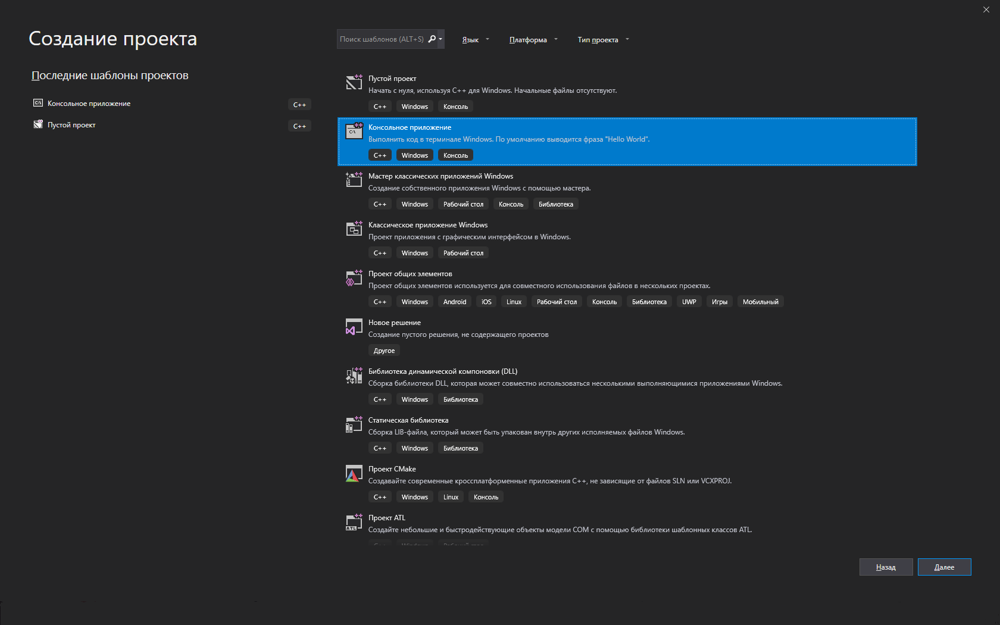
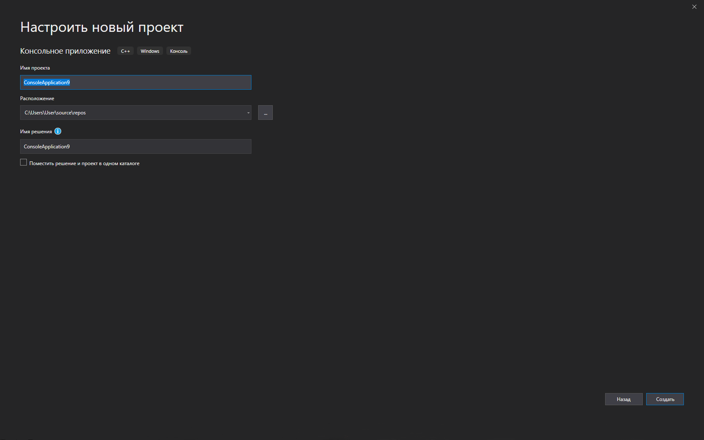
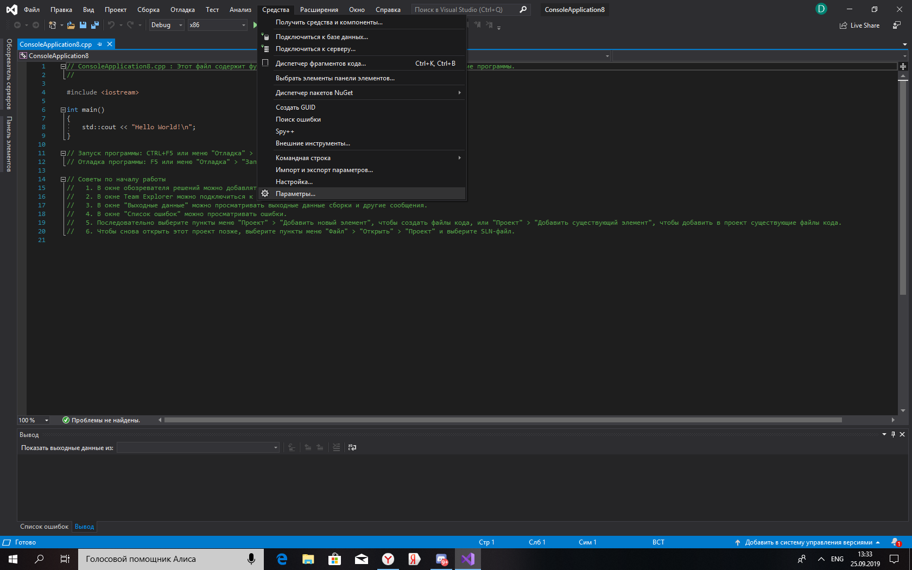
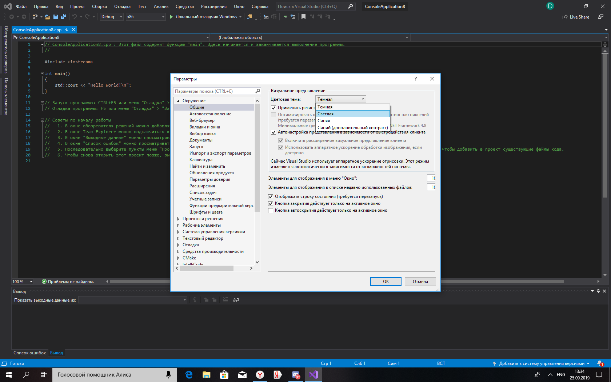
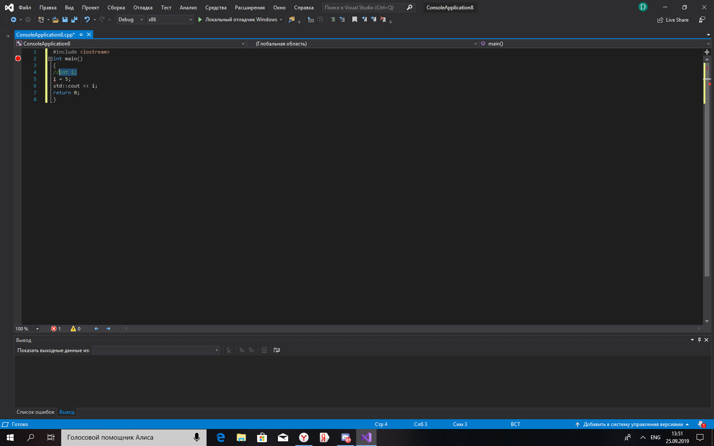
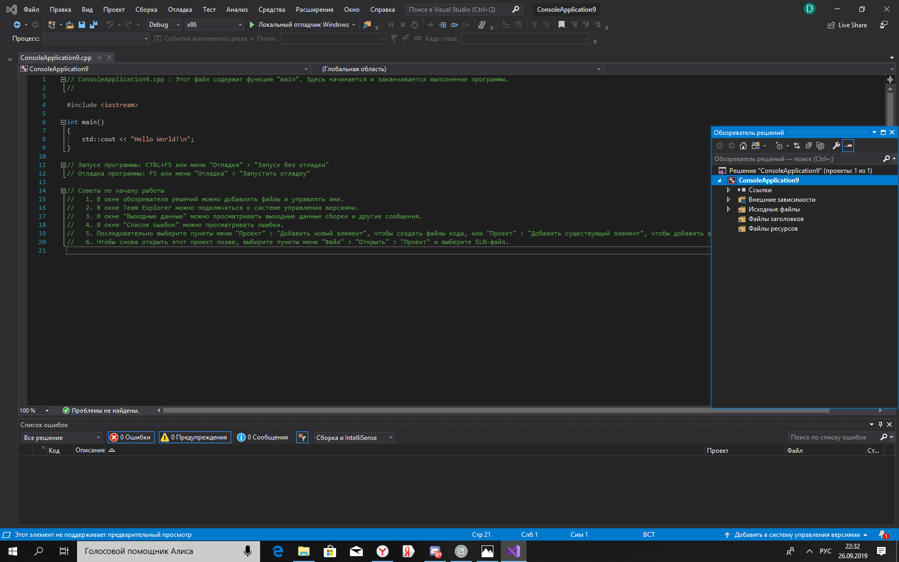
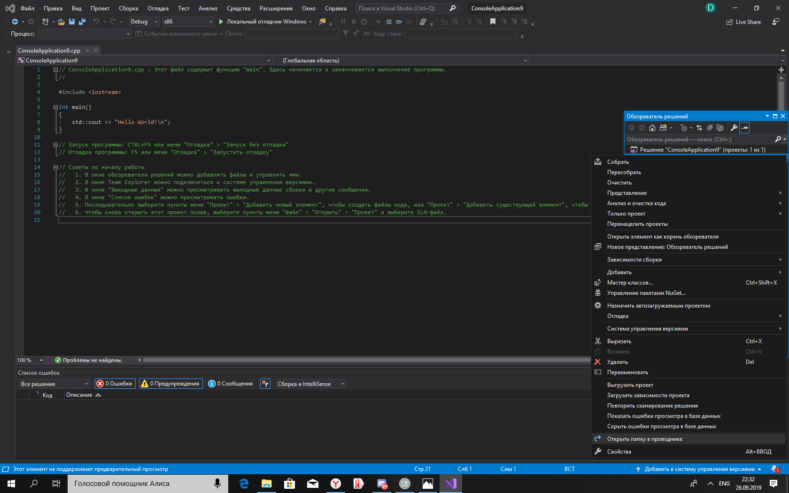
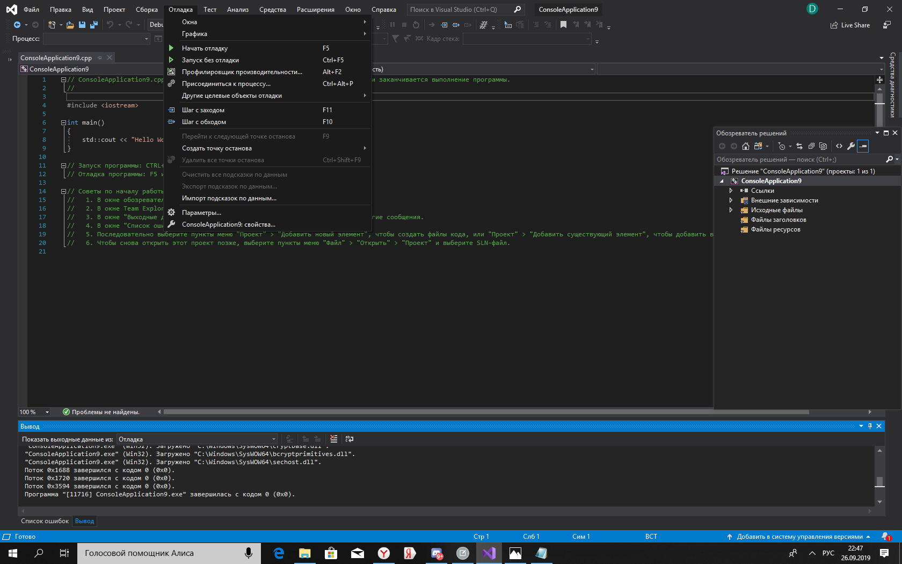
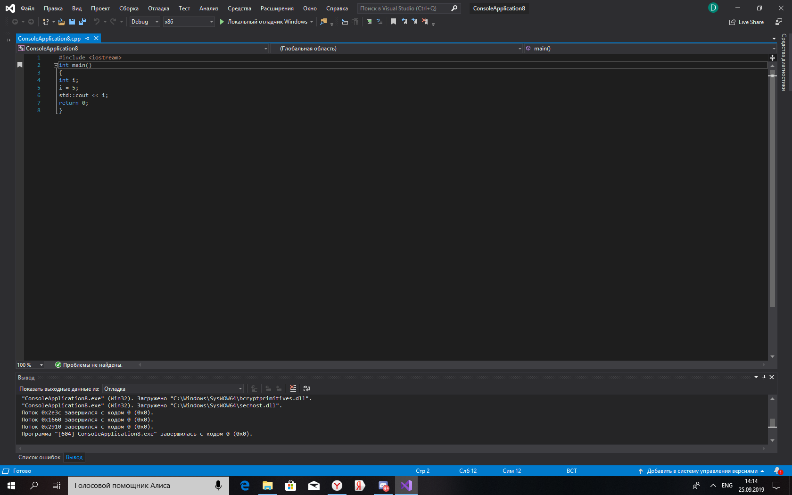

# Лабораторная работа №1. Изучение базовых возможностей MS Visual Studio
---
**Цель**: изучить основные возможности создания и отладки программ в IDE MS Visual Studio.

**Ход работы:**

**1.Как создать консольное приложение С++;**

В Visual Studio откройте файл меню и выберите New > проекта открыть создайте новый проект диалоговое окно. Выберите консольное приложение шаблона, а затем выберите Далее.



<p align="center">
Рис.1 (Cоздание проект в Visual Studio)
</p>

При создании нового проекта, в диалоговом окне введите "Мой новый проект" в имя_проекта. Выберите создать для создания проекта.



<p align="center">
Рис.2 (Настройка нового проекта)
</p>

**Как изменить цветовую схему (оформление) среды;**

В строке меню, где расположены разделы Файл и Изменить, выберите Средства > Параметры.



<p align="center">
Рис.3 (Выбор в строке меню Средства > Параметры) 
</p>
 
На странице параметров Среда > Общие измените значение параметра Цветовая тема на Светлая и нажмите кнопку ОК.



<p align="center">
Рис.4 (Выбор в параметрах для изменения цветовой темы)
</p>

**Как закомментировать/раскомментировать блок кода средствами VS;**

Используйте Ctrl+K, Ctrl+C для закомментирования кода.



<p align="center">
Рис.5 (Закомментирование кода)
</p>

Используйте Ctrl+K, Ctrl+U для раскомментирования кода.


<p align="center">
Рис.6 (Раскомментирования кода)
</p>

**Как открыть в проводнике Windows папку с проектом средствами VS;**

Комбинацией клавиш Ctrl+ж открываем "Обозреватель решений".



<p align="center">
Рис.7 (Открытие обозревателя решений)
</p>

После чего нажимаем ПКМ по названию вашего проекта и выбираем пункт "Открыть папку в проводнике"



<p align="center">
Рис.8 (Открытие папки в проводнике)
</p>

**Какое расширение файла-проекта используется в VS;**

У проекта в VS .sln расширение.

**Как запустить код без отладки (не менее 2 способов);**

Первый способ: заключаеться в нажатии комбинации клавиш Ctrl+F5

Второй способ: Находим в меню пункт "Откладка" ,затем выбираем подпункт "Запуск без откладки"



<p align="center">
Рис.9 (Запуск без откладки)
</p>

**Как запустить код в режиме отладки (не менее 2 способов);**

Первый способ:заключаеться в нажатии клавиши F5

Второй способ: Находим в меню пункт "Откладка" ,затем выбираем подпункт "Начать откладку"


<p align="center">
Рис.10 (Запуск с откладкой)
</p>

**Как установить/убрать точку останова (breakpoint);**

Для установки точки останова нужно выбрать необходимую строку и нажать F9.


<p align="center">
Рис.11 (Установка breakpoint)
</p>

Для удаления точки останова нужно выбрать необходимую строку и нажать F9.


 
<p align="center"> 
Рис.12 (Удаление breakpoint)
</p>

**Создайте программу со следующим кодом:**

``` 
#include <iostream>

int main() {
int i;
i = 5;
std::cout << i;
return 0;
}
```
* Переключитесь в конфигурацию сборки Debug;
* Установите breakpoint на 5 и 6 строках;
* Запустите приложение в режиме отладки. Используйте Кнопку Продолжить или Шаг с обходом для перемещения к следующей точке останова;
* Какое значение содержит переменная i в 5й строке? Правильный ответ:-858993460
* Какое значение содержит переменная i в 6й строке? Правильный ответ:5

**Выполните предыдущие задания изменив программу на следующую**

``` 
#include <iostream>

int main() {
double i;
i = 5;
std::cout << i;
return 0;
}
```
* Переключитесь в конфигурацию сборки Debug;
* Установите breakpoint на 5 и 6 строках;
* Запустите приложение в режиме отладки. Используйте Кнопку Продолжить или Шаг с обходом для перемещения к следующей точке останова;
* Какое значение содержит переменная i в 5й строке? Правильный ответ:-9.2559631349317831e+61
* Какое значение содержит переменная i в 6й строке? Правильный ответ:5.0000000000000000

**Вывод по работе**: изучил основные возможности создания и отладки программ в IDE MS Visual Studio.


