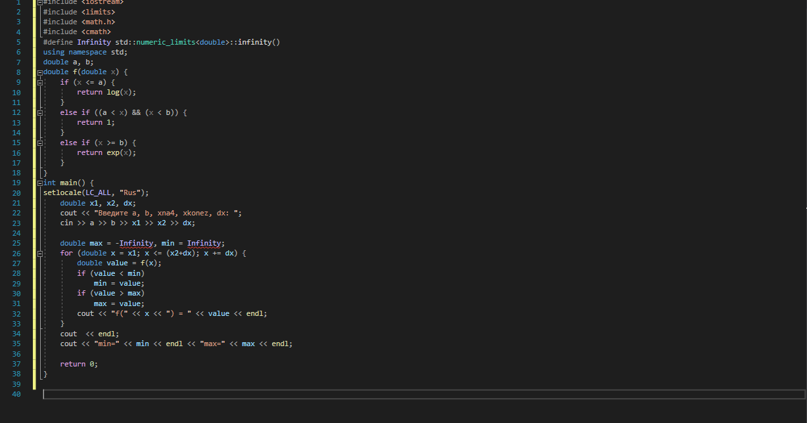
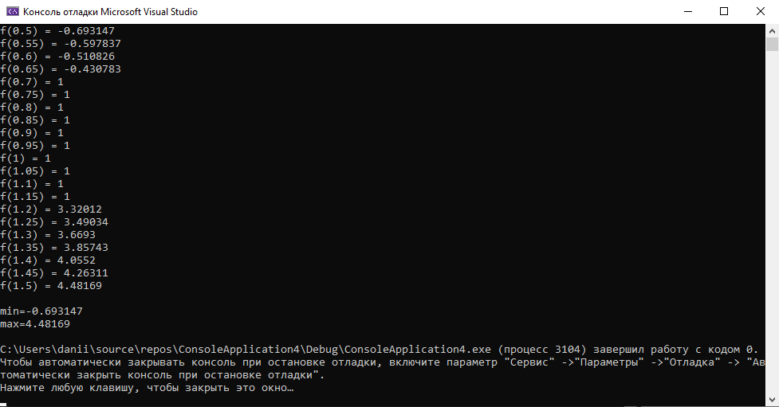
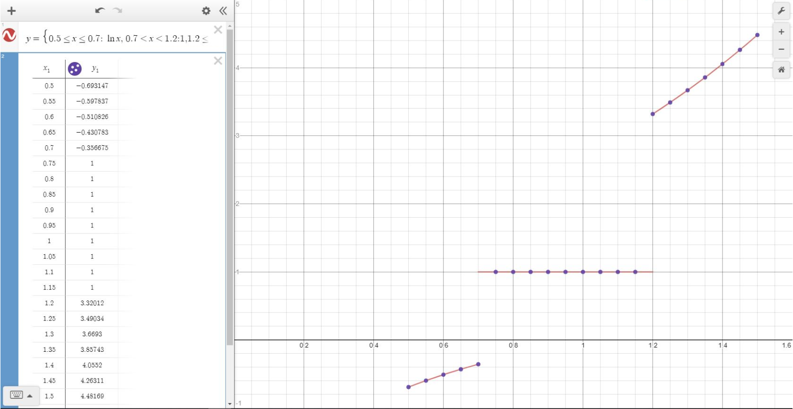
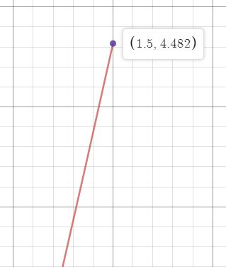
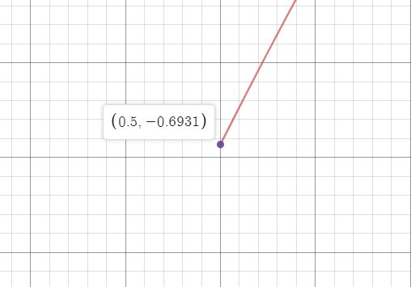

# Лабораторная работа №2. Табулирование кусочно-заданной функции
---
**Цель**: 

1.Сформировать навыков программирования алгоритмов разветвляющейся структуры

2.Овладеть практическими навыками разработки и программирования вычислительного процесса циклической структуры

3.Изучить операторы ветвления. Особенности использования полной и сокращенной формы оператора if и тернарного оператора

**Ход работы:**

1.Определяемся с функцией,наша функция находится под номером 9.

Рис.1 (Функция)
 

Далее мы пишем код для определения Min и Max значений функции на языке C++ в Visual Studio 2019.

Рис.2 (Код программы)

Анализируем на результат работы программы и определяем минимум и максимум.

Рис.3 (Результат программы)

 

Получившие результаты:

Max=4.48169

Min=-0.693147

Сверяем результаты полученные при компиляции нашей программы с результатами полученные на сайте.

Рис.4 (График в Desmos с точками из программы)

Максимум 

Рис.5 (Максимальное значение функции)

Минимум

Рис.6 (Минимальное значение функции)

В итоге проведенных сравнений,мы убедились , что получившиеся результаты совподают и можем сделать из этого вывод программа - написана правильно.

**Вывод по работе**: Овладел практическими навыками разработки и программирования вычислительного процесса циклической структуры. Сформировал навыкои программирования алгоритмов разветвляющейся структуры. Изучил операторы ветвления, Особенности использования полной и сокращенной формы оператора if и тернарного оператора.

