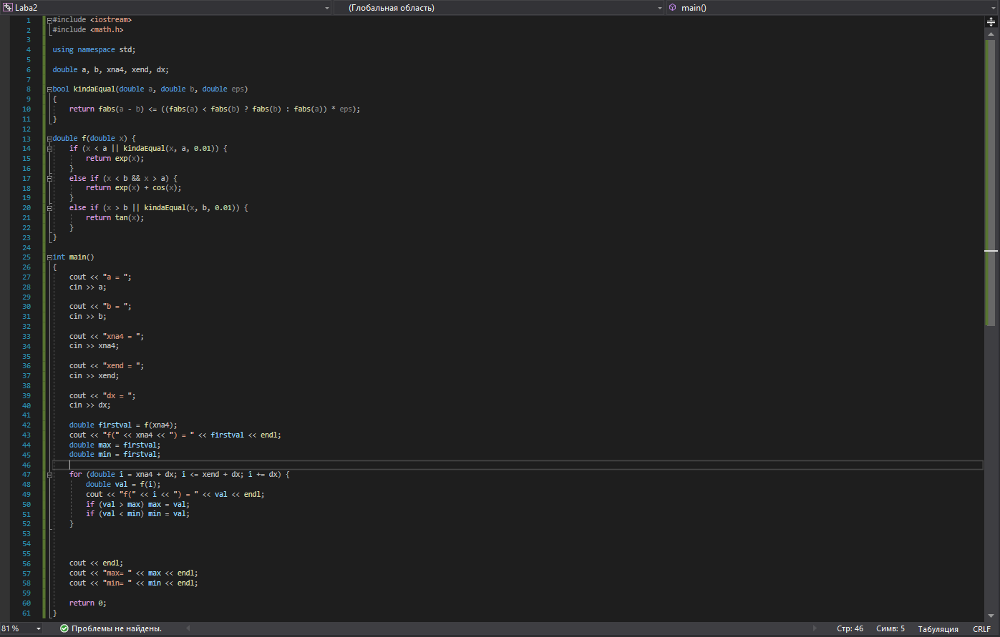
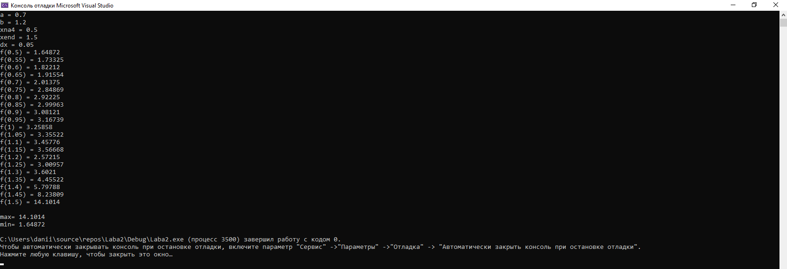
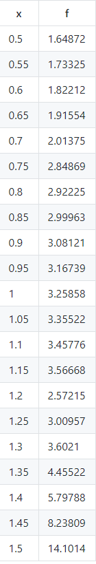
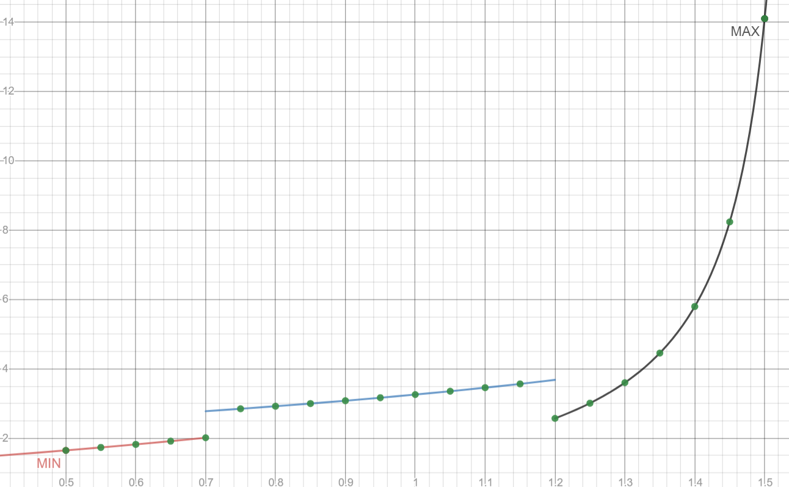

МИНИСТЕРСТВО НАУКИ  И ВЫСШЕГО ОБРАЗОВАНИЯ РОССИЙСКОЙ ФЕДЕРАЦИИ 
Федеральное государственное автономное образовательное учреждение высшего образования 
"КРЫМСКИЙ ФЕДЕРАЛЬНЫЙ УНИВЕРСИТЕТ им. В. И. ВЕРНАДСКОГО" 
ФИЗИКО-ТЕХНИЧЕСКИЙ ИНСТИТУТ 
Кафедра компьютерной инженерии и моделирования

 
<h3 align="center">Отчёт по лабораторной работе № 2  по дисциплине "Программирование"</h3>
  

студента 1 курса группы ПИ-б-о-192(2) 
Кельник Даниил Александрович 
направления подготовки 09.03.04 "Программная инженерия"

  
<table>
<tr><td>Научный руководитель  старший преподаватель кафедры  компьютерной инженерии и моделирования</td>
<td>(оценка)</td>
<td>Чабанов В.В.</td>
</tr>
</table>
  

Симферополь, 2020

# Лабораторная работа №2. Табулирование кусочно-заданной функции
---
**Цель**: 

1.Сформировать навыков программирования алгоритмов разветвляющейся структуры

2.Овладеть практическими навыками разработки и программирования вычислительного процесса циклической структуры

3.Изучить операторы ветвления. Особенности использования полной и сокращенной формы оператора if и тернарного оператора

**Ход работы:**

1.Написал на языке C++ программу, которая для функции f(x) на определенном интервале выводит в консоль: значения f(x) с шагом dx; максимальное и минимальное значение функции на интервале.

*Рис.1 (Функция.)*

Далее мы пишем код для определения Min и Max значений функции на языке C++ в Visual Studio 2019.

*Рис.2 (Код программы.)*

*Рис.3 (Результат программы.)* 

Запустил программу, ввел необходимые начальные данные и вписал вывод в таблицу:

*Рис.4 (Таблица.)

Max=1.64872

Min=14.1014

Используя https://www.desmos.com/calculator построил график функции (Рис.1), добавил на график точки, получившиеся в процессе табуляции. Добавил на график точки минимума и максимума.

*Рис.5(Построение графика.)*

**Вывод по работе**: Овладел практическими навыками разработки и программирования вычислительного процесса циклической структуры. Сформировал навыкои программирования алгоритмов разветвляющейся структуры. Изучил операторы ветвления, Особенности использования полной и сокращенной формы оператора if и тернарного оператора.

