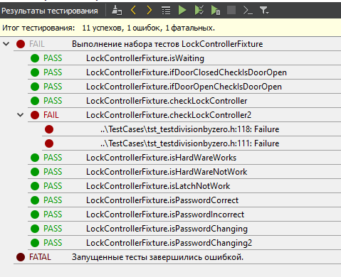
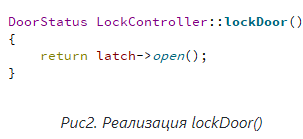

МИНИСТЕРСТВО НАУКИ  И ВЫСШЕГО ОБРАЗОВАНИЯ РОССИЙСКОЙ ФЕДЕРАЦИИ 
Федеральное государственное автономное образовательное учреждение высшего образования 
"КРЫМСКИЙ ФЕДЕРАЛЬНЫЙ УНИВЕРСИТЕТ им. В. И. ВЕРНАДСКОГО" 
ФИЗИКО-ТЕХНИЧЕСКИЙ ИНСТИТУТ 
Кафедра компьютерной инженерии и моделирования

 
<h3 align="center">Отчёт по лабораторной работе № 9  по дисциплине "Программирование"</h3>
  

студента 1 курса группы ПИ-б-о-192(2) 
Кельник Даниил Александрович 
направления подготовки 09.03.04 "Программная инженерия"

  
<table>
<tr><td>Научный руководитель  старший преподаватель кафедры  компьютерной инженерии и моделирования</td>
<td>(оценка)</td>
<td>Чабанов В.В.</td>
</tr>
</table>
  

Симферополь, 2020

<h3> Цель: </h3>

1.Познакомиться с Google Test и Google Mock Framework; 
2.Изучить базовые понятия относящийся к тестированию кода; 
3.Научиться тестировать классы в среде разработки Qt Creator.

<h3 align = "center"> Ход работы </h3>
Тестовый проект: <a href ="https://github.com/KelnikDaniil/PI-192-2-/tree/master/Лабораторная%209/Cases">Cases</a> 
После реализации тест-кейсов я получил следующий вывод: 

<i>Рис. 1. Результаты тестов</i>

Ошибка в тесте №5 возникает из-за реализации метода lockDoor(),то есть возвращает latch->open(), а мы проверяем на close(). Для верного прохождения теста необходимо возвращать latch->close() в следующем методе:

<i>Рис. 2. Реализация lockDoor()</i>

<h3> Вывод </h3>

Познакомился с Google Test и Google Mock Framework. Изучил базовые понятия относящийся к тестированию кода. Научился тестировать классы в среде разработки Qt Creator.

